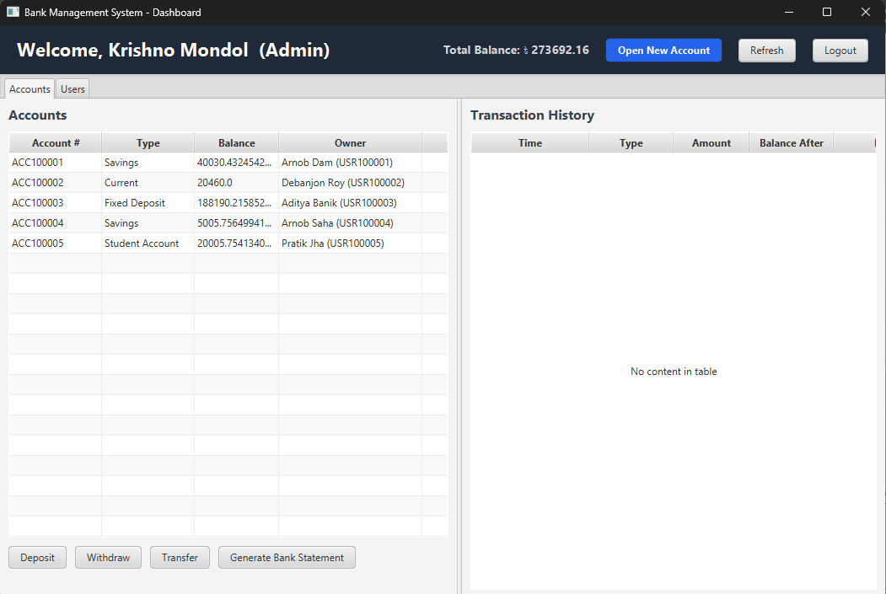

# 🏦 Bank Management System

A desktop **Bank Management System** built with **Java 17, JavaFX 21, Maven, and SQLite**.  
The application provides an admin-operated banking environment for creating customer accounts, performing transactions, tracking balances, maintaining transaction history, and generating individual bank statements in JSON format.

> **Project type:** Desktop application  
> **Language:** Java 17  
> **UI:** JavaFX 21.0.2 + FXML  
> **Build tool:** Maven  
> **Database:** SQLite  
> **Currency:** Bangladeshi Taka (৳)

---

## 📸 Application Screenshots

### 1. Log in Window


The administrator signs in using a username and password before accessing the banking dashboard.

### 2. Dashboard



The dashboard provides an overview of customers, accounts, balances, transaction history, and banking operations.

### 3. Create a New User / Account Window


Administrators can create a new customer and open an account by entering customer information, identification details, account type, and an optional initial deposit.

### 4. Deposit Window


Deposits can be made to a selected account. Every successful deposit is recorded in the account's transaction history.

### 5. Withdraw Window


Administrators can withdraw funds from a selected account. Withdrawals are rejected when the account does not contain sufficient funds.

### 6. Transfer Window


Funds can be transferred from the selected account to another account. The system prevents transfers to the same account and rejects transfers when the sender has insufficient funds.

### 7. Individual Transaction History


Selecting an account displays its transaction history, including transaction time, type, amount, balance after the transaction, and description.

### 8. Individual Bank Statement


A complete statement can be generated for an account. The application displays the account information, customer information, current balance, and transaction history.

### 9. JSON Files for Bank Statements


Generated statements are saved as JSON files in the `statements/` directory.

### 10. Admin's Database


Administrator records are persisted in the SQLite database file:

`data/Admins.db`

### 11. User's Database


Customer, account, and transaction data are persisted in:

`data/Users.db`

---

# ✨ Features

## 🔐 1. Administrator Authentication

- Secure administrator login.
- Administrator registration screen.
- Username uniqueness validation.
- Password confirmation during registration.
- Passwords are stored as SHA-256 hashes rather than plain text.
- A default administrator is created automatically when the admin database is empty.

### Default administrator

```text
Username: admin
Password: admin123
```

**Important:** This default credential is intended for development/demo use. Change or remove it before using the project in a real banking environment.

---

## 👤 2. Customer Management

The system maintains customer information including:

- Automatically generated User ID (`USR...`)
- Full name
- Phone number
- Identification type
- Identification number
- Account ownership
- Account count

A customer is identified by their identification number. If an existing identification number is used while opening another account, the new account is associated with the existing customer instead of creating a duplicate customer.

---

## 🏦 3. Multiple Account Types

The application supports four account types:

| Account Type | Annual Interest Rate |
|---|---:|
| Savings | **3.00%** |
| Current | **0.00%** |
| Fixed Deposit | **6.00%** |
| Student Account | **1.50%** |

Account numbers are automatically generated in the form:

```text
ACC100001
ACC100002
ACC100003
...
```

Customer IDs are automatically generated in the form:

```text
USR100001
USR100002
USR100003
...
```

---

## 💰 4. Deposit

Administrators can deposit money into any selected account.

The system:

1. Validates the account.
2. Validates that the amount is positive.
3. Adds the amount to the account balance.
4. Creates a `DEPOSIT` transaction.
5. Stores the updated data in SQLite.
6. Refreshes the dashboard.

---

## 💸 5. Withdrawal

Administrators can withdraw money from a selected account.

The system:

- Rejects invalid or non-positive amounts.
- Prevents withdrawals greater than the current balance.
- Updates the balance atomically.
- Creates a `WITHDRAW` transaction.
- Saves the updated state to the database.

---

## 🔄 6. Account-to-Account Transfer

The application supports transfers between accounts.

Transfer validation includes:

- Sender account must exist.
- Receiver account must exist.
- Sender and receiver cannot be the same account.
- Transfer amount must be positive.
- Sender must have sufficient funds.

A transfer creates two transaction records:

- `TRANSFER_OUT` for the sender.
- `TRANSFER_IN` for the receiver.

The transfer logic uses account locking and a consistent lock order to reduce the possibility of deadlocks when multiple transactions are processed concurrently.

---

## 📜 7. Individual Transaction History

Each account maintains its own transaction history.

Each transaction contains:

- Transaction ID
- Account number
- Timestamp
- Transaction type
- Amount
- Balance after transaction
- Description

Supported transaction types include:

```text
DEPOSIT
WITHDRAW
TRANSFER_IN
TRANSFER_OUT
INTEREST
```

The dashboard shows the selected account's history with the newest transactions displayed first.

---

## 📄 8. Bank Statement Generation

The application can generate a complete statement for a selected account.

A generated statement contains:

- Statement generation time
- Account ID
- Account type
- Account creation time
- Current balance
- Customer information
- Customer ID
- Customer name
- Phone number
- Identification type
- Identification number
- Total transaction count
- Complete transaction list

Statements are saved automatically in:

```text
statements/
```

with filenames similar to:

```text
ACC100001_20260927_173000.json
```

---

## 🧾 9. JSON Bank Statements

The statement generator creates standard JSON files without requiring an additional JSON library.

A generated statement follows this general structure:

```json
{
  "statementGeneratedAt": "2026-09-27 17:30:00",
  "accountId": "ACC100001",
  "accountType": "Savings",
  "accountCreatedAt": "2026-09-27 17:00:00",
  "currentBalance": 15000,
  "customer": {
    "userId": "USR100001",
    "fullName": "Example Customer",
    "phoneNumber": "01XXXXXXXXX",
    "idType": "NID",
    "idNumber": "1234567890"
  },
  "transactionCount": 3,
  "transactions": [
    {
      "id": 1,
      "timestamp": "2026-09-27 17:01:00",
      "type": "DEPOSIT",
      "amount": 10000,
      "balanceAfter": 10000,
      "description": "Initial deposit"
    }
  ]
}
```

---

## 📈 10. Automatic Interest Calculation

The application includes an automatic interest scheduler.

### Configured annual rates

| Account | Annual Rate |
|---|---:|
| Savings | 3% |
| Current | 0% |
| Fixed Deposit | 6% |
| Student Account | 1.5% |

### How the current implementation works

The scheduler starts when the application launches and runs every **30 seconds**.

For each interest-bearing account, it calculates:

```text
periodic interest = current balance × (annual rate / 365)
```

and records the result as an `INTEREST` transaction.

### Important implementation note

This is a **demonstration/project implementation**, not a real-world banking interest schedule. Although the configured rates are annual rates, the current scheduler applies the daily fraction **every 30 seconds**. Therefore, interest can accumulate much faster than it would in a real banking system.

For production use, the scheduler should instead track the actual elapsed period and credit interest according to the institution's defined daily/monthly/annual rules.

---

## 🗄️ 11. SQLite Persistence

The project uses SQLite for persistent local storage.

### Admin database

```text
data/Admins.db
```

Stores administrator information and password hashes.

### User database

```text
data/Users.db
```

Contains:

- `users`
- `accounts`
- `transactions`
- `metadata`

This allows the application to retain its data between executions.

---

## 🔁 12. Legacy Database Migration

The project contains compatibility logic for older serialized database files.

If an existing `Admins.db` or `Users.db` is detected as a legacy serialized store rather than a SQLite database, the application can:

1. Read the legacy data.
2. Back up the old file.
3. Initialize the SQLite database.
4. Import the legacy records.
5. Continue using SQLite.

Legacy backups are created with a timestamped filename.

---

## ⚡ 13. Multithreaded Transaction Processing

Banking operations are not performed directly on the JavaFX UI thread.

The application uses:

- A fixed transaction thread pool.
- Background JavaFX `Task`s.
- Account-level `ReentrantLock`s.
- A dedicated interest scheduler.

This keeps the user interface responsive while transactions and interest calculations are processed in the background.

---

## 🔄 14. Live Dashboard Refresh

The dashboard listens for banking data changes.

After operations such as:

- Account creation
- Deposit
- Withdrawal
- Transfer
- Interest credit

the dashboard can refresh its displayed account, balance, user, and transaction information.

---

## 💱 15. Bangladeshi Taka Support

The UI uses the Bangladeshi Taka symbol:

```text
৳
```

Examples:

```text
Amount (৳)
Current Balance: ৳ 15,000.00
Total Balance: ৳ 50,000.00
```

---

# 🖥️ Technology Stack

| Technology | Purpose |
|---|---|
| **Java 17** | Application programming language |
| **JavaFX 21.0.2** | Desktop graphical user interface |
| **FXML** | UI layout and screen definition |
| **CSS** | JavaFX application styling |
| **Maven** | Dependency management and build automation |
| **SQLite** | Local persistent database |
| **SQLite JDBC** | Java-to-SQLite connectivity |
| **ExecutorService** | Background transaction processing |
| **ScheduledExecutorService** | Automatic interest processing |
| **JSON** | Bank statement export format |

---

# 📁 Project Structure

```text
Bank-Management-System-main/
│
├── data/
│   ├── Admins.db
│   └── Users.db
│
├── src/
│   └── main/
│       ├── java/
│       │   └── com/
│       │       └── bank/
│       │           ├── Main.java
│       │           │
│       │           ├── controller/
│       │           │   ├── DashboardController.java
│       │           │   ├── LoginController.java
│       │           │   ├── OpenAccountController.java
│       │           │   ├── RegisterController.java
│       │           │   ├── StatementController.java
│       │           │   └── TransferController.java
│       │           │
│       │           ├── model/
│       │           │   ├── Account.java
│       │           │   ├── AccountType.java
│       │           │   ├── Admin.java
│       │           │   ├── IdType.java
│       │           │   ├── Transaction.java
│       │           │   ├── TransactionType.java
│       │           │   └── User.java
│       │           │
│       │           ├── persistence/
│       │           │   ├── FileDatabase.java
│       │           │   └── SQLiteDatabase.java
│       │           │
│       │           └── service/
│       │               ├── BankService.java
│       │               ├── PasswordUtil.java
│       │               ├── StatementGenerator.java
│       │               └── TransactionResult.java
│       │
│       └── resources/
│           ├── css/
│           │   └── style.css
│           └── fxml/
│               ├── Dashboard.fxml
│               ├── Login.fxml
│               ├── OpenAccountDialog.fxml
│               ├── Register.fxml
│               ├── StatementView.fxml
│               └── TransferDialog.fxml
│
├── pom.xml
├── statements/
└── README.md
```

---

# 🧩 Application Architecture

The project is organized into several logical layers.

```text
┌─────────────────────────────────────┐
│             JavaFX UI               │
│       FXML + Controllers + CSS      │
└──────────────────┬──────────────────┘
                   │
                   ▼
┌─────────────────────────────────────┐
│          BankService Layer          │
│ Authentication / Accounts / Txns    │
│ Interest / Validation / Scheduling  │
└──────────────────┬──────────────────┘
                   │
          ┌────────┴─────────┐
          ▼                  ▼
┌─────────────────┐  ┌─────────────────┐
│  Model Layer    │  │ Persistence     │
│ User            │  │ SQLiteDatabase  │
│ Account         │  │ FileDatabase    │
│ Transaction     │  └────────┬────────┘
│ Admin           │           │
└─────────────────┘           ▼
                       ┌───────────────┐
                       │ SQLite .db    │
                       │ Admins.db     │
                       │ Users.db      │
                       └───────────────┘
```

### Main responsibilities

**Controllers**
- Handle JavaFX events.
- Read user input.
- Update the interface.
- Start background tasks.

**Models**
- Represent users, accounts, administrators, and transactions.

**BankService**
- Central banking/business logic.
- Authentication.
- Account creation.
- Deposits.
- Withdrawals.
- Transfers.
- Interest calculation.
- Persistence coordination.

**Persistence**
- Reads and writes SQLite databases.
- Maintains persistent banking data.

**StatementGenerator**
- Creates JSON bank statements.

---

# ⚙️ Requirements

Before running the project, install:

### Required

- **JDK 17 or newer**
- **Apache Maven 3.8+ recommended**
- IntelliJ IDEA, Eclipse, VS Code, NetBeans, or another Java/Maven-compatible IDE

You can verify Java and Maven from a terminal:

```bash
java -version
mvn -version
```

The project is configured for:

```text
Java source/target: 17
JavaFX: 21.0.2
```

---

# ▶️ Running the Project

## Method 1 — IntelliJ IDEA

### Step 1: Open the project

In IntelliJ IDEA:

```text
File → Open
```

Select the folder containing:

```text
pom.xml
```

Do **not** open only the `src` folder.

### Step 2: Allow Maven to import the project

IntelliJ should detect `pom.xml` automatically.

Wait until Maven finishes downloading:

- JavaFX
- SQLite JDBC
- Maven plugins
- Other dependencies

### Step 3: Select a JDK

Go to:

```text
File → Project Structure → Project
```

Set the project SDK to **JDK 17 or newer**.

### Step 4: Run with Maven

Open the Maven tool window:

```text
View → Tool Windows → Maven
```

Then run:

```text
Plugins → javafx → javafx:run
```

Or use IntelliJ's Maven goal runner with:

```bash
mvn clean javafx:run
```

### Alternative

You can also run:

```text
src/main/java/com/bank/Main.java
```

after Maven has successfully imported all dependencies.

For the most consistent setup, **`mvn javafx:run` is recommended** because Maven manages the JavaFX runtime dependencies.

---

# 🟦 Running with Eclipse

### Step 1: Import the Maven project

In Eclipse:

```text
File → Import
→ Maven
→ Existing Maven Projects
```

Select the project directory containing:

```text
pom.xml
```

Click **Finish**.

### Step 2: Configure JDK 17+

Go to:

```text
Window → Preferences
→ Java → Installed JREs
```

Select a JDK 17 or newer installation.

Then ensure the project uses that JDK.

### Step 3: Download Maven dependencies

Eclipse should resolve the dependencies automatically.

If necessary:

```text
Right-click project
→ Maven
→ Update Project
```

### Step 4: Run using Maven

The recommended Eclipse method is:

```text
Right-click project
→ Run As
→ Maven build...
```

Use:

```text
Goals:
javafx:run
```

For a clean build:

```text
clean javafx:run
```

Click **Run**.

---

# 🟩 Running from the Terminal

Open a terminal in the directory containing `pom.xml`.

### Run directly

```bash
mvn javafx:run
```

### Clean and run

```bash
mvn clean javafx:run
```

### Compile/package

```bash
mvn clean package
```

For development, `mvn javafx:run` is the simplest way to launch the application because the JavaFX runtime is configured through Maven.

---

# 🟨 Running with VS Code

1. Install the **Extension Pack for Java**.
2. Install/configure JDK 17 or newer.
3. Open the project folder containing `pom.xml`.
4. Allow Maven dependencies to load.
5. Open the integrated terminal.
6. Run:

```bash
mvn clean javafx:run
```

---

# 🟥 Running with NetBeans

1. Open NetBeans.
2. Select:

```text
File → Open Project
```

3. Open the Maven project containing `pom.xml`.
4. Allow Maven to resolve dependencies.
5. Run the Maven goal:

```text
javafx:run
```

Alternatively, use the NetBeans terminal and run:

```bash
mvn clean javafx:run
```

---

# 🌍 Cross-Platform Support

The application is designed to run on major desktop operating systems supported by Java and JavaFX.

## Supported platforms

The project can be used on:

- 🪟 Windows
- 🍎 macOS
- 🐧 Linux

The application itself does not use Windows-only, macOS-only, or Linux-only APIs.

### Why is it cross-platform?

The project is based on:

```text
Java
   ↓
JavaFX
   ↓
Maven
   ↓
SQLite JDBC
```

### 1. Java is cross-platform

Java applications run through the Java Virtual Machine (JVM), so the same Java source code can run on different operating systems.

### 2. JavaFX is cross-platform

JavaFX provides the desktop UI layer for Windows, macOS, and Linux.

### 3. Maven manages dependencies

The `pom.xml` declares the JavaFX and SQLite dependencies instead of requiring the developer to manually copy platform-specific libraries into the project.

### 4. SQLite is embedded

SQLite stores the application's data locally in:

```text
data/Admins.db
data/Users.db
```

No external database server is required.

### 5. No OS-specific file paths

The application uses Java's file APIs and relative paths such as:

```text
data/
statements/
```

rather than hard-coded Windows paths such as:

```text
C:\Users\...
```

### Important cross-platform consideration

Run the application from the **project root / Maven working directory** so that relative directories such as `data/` and `statements/` are resolved consistently.

---

# 🗃️ Database Design

## Admins.db

The administrator database contains:

```text
admins
├── username
├── password_hash
├── full_name
├── email
├── phone_number
└── id_number
```

## Users.db

The user database contains:

### users

```text
user_id
full_name
phone_number
id_type
id_number
created_at
```

### accounts

```text
account_number
owner_user_id
account_type
balance
created_at
```

### transactions

```text
id
account_number
transaction_type
amount
balance_after
description
timestamp
```

### metadata

Stores database-related metadata such as generated ID sequences.

---

# 🔢 Account and User ID Generation

The system automatically generates identifiers.

### User IDs

```text
USR100001
USR100002
USR100003
```

### Account numbers

```text
ACC100001
ACC100002
ACC100003
```

This avoids requiring administrators to manually create account numbers.

---

# 🔒 Transaction Safety

The application includes several protections around banking operations:

- Positive amount validation.
- Insufficient-balance checks.
- Account existence checks.
- Same-account transfer prevention.
- Account-level locking.
- Consistent lock ordering for transfers.
- Background transaction execution.
- Database persistence after successful operations.

These mechanisms are intended to make the application safer for a desktop banking-system demonstration.

---

# 🧪 Example Workflow

A typical workflow is:

```text
Start Application
       │
       ▼
Admin Login
       │
       ▼
Dashboard
       │
       ├───────────────┐
       ▼               ▼
Create Customer     Select Account
       │               │
       ▼               ├── Deposit
Create Account        ├── Withdraw
       │               ├── Transfer
       │               ├── View History
       │               └── Generate Statement
       ▼
SQLite Database
       │
       ▼
JSON Statement
```

---

# 🚀 Quick Start

For experienced users:

```bash
git clone https://github.com/KrishnoMD305/Bank-Management-System.git
cd Bank-Management-System-main
mvn clean javafx:run
```

Then log in with:

```text
Username: admin
Password: admin123
```

---

# 🧑‍💻 Development

The project follows a simple MVC-inspired structure:

```text
Model
  ↓
Service / Business Logic
  ↓
Controller
  ↓
JavaFX / FXML UI
```

FXML files define the interface while Java controllers handle events and communicate with `BankService`.

---

# 📌 Important Runtime Directories

The application creates/uses:

```text
data/
```

for SQLite databases and:

```text
statements/
```

for generated JSON bank statements.

Do not delete these directories if you want to preserve application data.

---

# 🙌 Project Summary

**Bank Management System** is a JavaFX desktop banking application demonstrating:

- Administrator authentication
- Customer management
- Multiple account types
- Account creation
- Deposits
- Withdrawals
- Account transfers
- Automatic interest calculation
- Transaction history
- Individual bank statements
- JSON statement generation
- SQLite persistence
- Multithreaded transaction processing
- Background scheduling
- Cross-platform JavaFX execution
- Maven-based dependency management

It is designed to demonstrate practical Java software engineering concepts including **object-oriented programming, GUI development, database persistence, concurrency, file generation, background processing, and application architecture**.
